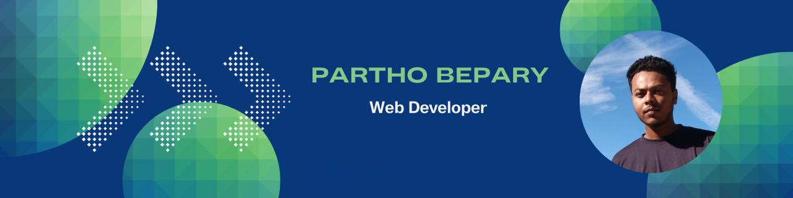
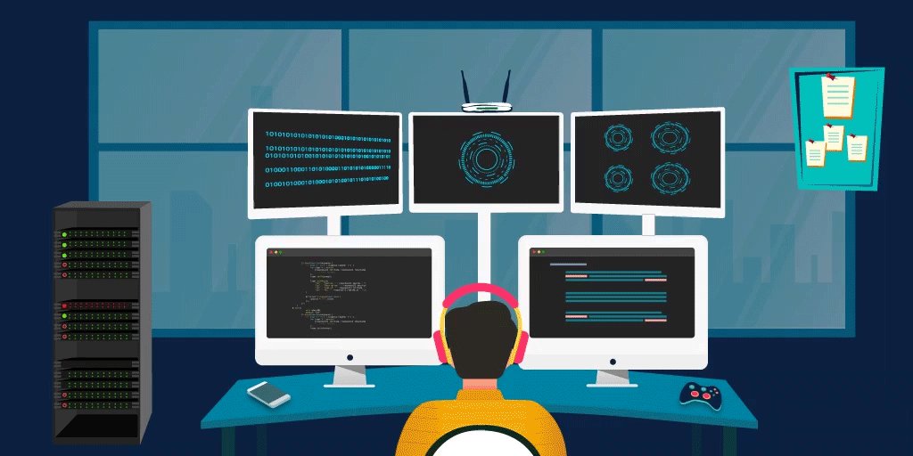

  
### Software Engineer || Full Stack Developer 
<h2>Hey there! I'm Partho</h2>

<!-- ## 👋 &nbsp;Hey there! I'm Partho bepary -->

### 👨🏻‍💻 &nbsp;About Me

💡 &nbsp;I like to explore new technologies and develop software solutions and quick hacks.\
🎓 &nbsp;I'm currently studying Computer Science and engineer at the University of DIU\
🌱 &nbsp;I'm on track for learning more about Artificial Intelligence, Systems Design, and Cloud Architecture.\
✍️ &nbsp;In my free time, I pursue Blog Writing as hobbies/side hustles.\
💬 &nbsp;Feel free to reach out to me for pro bono consulting and volunteering, or just for some interesting discussion.\
✉️ &nbsp;You can shoot me an email at beparypartho@gmail.com! or call me +88 01798339054 I'll try to respond as soon as I can.\
📄 &nbsp;Please have a look at my [Résumé]([https://www.adityavsingh.com/resume.html](https://drive.google.com/file/d/10c1fsUP0rcfgH020MTFLczqXV3EQvnjf/view?usp=sharing)) for more details about me. I'm open to feedback and suggestions!

### 🏆 &nbsp;Achievements & Projects

- 🚀 Built a CMS-based multi-theme website builder using Nuxt 3 & Tailwind CSS.
- 🛍️ Developed an eCommerce platform with automatic settings generation for new shops.
- 🔧 Created an advanced dashboard system using Laravel Filament and Reverb.
- 🌐 Built and deployed business websites for real-world clients like **Energy Hub Bangladesh**.
- ✨ Open-source contributor to multiple JavaScript and Vue.js projects.

You can check out my work in the pinned repositories or on [my portfolio](https://parthobepary.vercel.app).

### 🛠 &nbsp;Tech Stack

<!-- &nbsp; -->
&nbsp;
&nbsp;
&nbsp;
&nbsp;
&nbsp;
&nbsp;
&nbsp;
&nbsp;
&nbsp;
\

&nbsp;
&nbsp;
&nbsp;
&nbsp;
\

### 🧰 &nbsp;Tools & Platforms

### ⚙️ &nbsp;GitHub Analytics

### 🎯 &nbsp;Fun Facts

- 🎵 I love coding while listening to Lofi or instrumental music.
- 🧩 I enjoy solving logic puzzles and competitive programming problems.
- 🍕 Pizza & Coffee fuel my late-night coding sessions!

 

### 🤝🏻 &nbsp;Connect with Me

